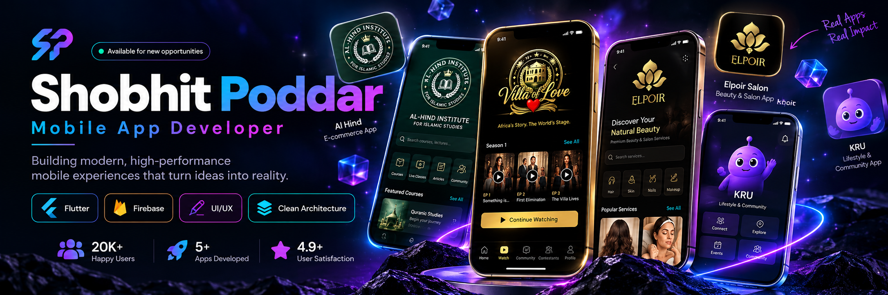

 

I build production mobile and web products end to end, from Flutter apps and Next.js panels to serverless Firebase backends and payments.

 

`Flutter & Firebase` · `Next.js & React` · `MERN` · `Stripe & RevenueCat` · `650+ DSA Problems`

---

## Professional Summary

I am a **full stack developer working across Flutter, Firebase, and the modern React ecosystem**. At **FlutterYourWay** I own products from the first wireframe to the App Store listing: UI/UX, Flutter client, Next.js admin panel, Firestore data model, Cloud Functions, payments, subscriptions, analytics, and release.

My foundation is the **MERN stack**, which is where I learned to think about the full product lifecycle across clients, APIs, databases, and deployment. That background is why I am comfortable moving between a Dart widget tree, an Express route, and a Firebase security rule in the same afternoon.

I care about premium interfaces, serverless architectures that stay cheap at scale, and shipping software that real users depend on every day.

---

## Core Expertise

| Area | Skills |
|---|---|
| **Mobile Development** | Flutter, Dart, responsive UI, app architecture, state management, Play Store and App Store releases |
| **Web & Frontend** | Next.js, React.js, TypeScript, TailwindCSS, HTML5, CSS3, pixel-perfect Figma implementation |
| **Backend & Serverless** | Node.js, Express.js, Firebase Cloud Functions, REST APIs, webhooks, real-time listeners |
| **Databases** | Firestore, Realtime Database, MongoDB, SQL |
| **Payments & Integrations** | Stripe, RevenueCat, Eway, Zoom API, Clerk, Sentry, Claude and OpenAI APIs |
| **Languages** | C++, Java, JavaScript, TypeScript, Dart |
| **Engineering Tools** | Git, GitHub, VPS deployment with CI/CD, Firebase Console, Figma |

---

## Selected Projects

<table>
<tr>
<td width="50%" valign="top">
<h3>Villa of Love</h3>

<strong>Streaming &amp; Fan App for a Pan-African TV Series</strong> · <code>Production</code>

Sole end-to-end developer of the official companion app for a reality TV series, spanning mobile, TV, and web.

<ul>
<li>Netflix-style episode streaming with a 24/7 live channel</li>
<li>WhatsApp-style real-time chat and Instagram-style reels feed</li>
<li>Live audience voting with real-time tallies</li>
<li>In-app purchases and subscription entitlements</li>
<li>Next.js admin panel for content, users, and voting control</li>
</ul>
</td>
<td width="50%" valign="top">
<h3>Prime Mentor</h3>

<strong>EdTech SaaS Platform</strong> · <code>150+ Users</code>

A production EdTech platform with separate Admin, Teacher, and Student experiences.

<ul>
<li>Three role-based panels sharing one MERN backend</li>
<li>Eway payment gateway for course transactions</li>
<li>Zoom API integration for live virtual classrooms</li>
<li>Secure auth with Clerk, JWT, and Bcrypt.js; Multer for file storage</li>
<li>Deployed on Hostinger VPS with CI/CD and 99%+ uptime</li>
</ul>
</td>
</tr>
<tr>
<td width="50%" valign="top">
<h3>Elpoir Salon</h3>

<strong>Connected User &amp; Business App Ecosystem</strong> · <code>Production</code>

Two Flutter apps and their admin tooling operating as a single system.

<ul>
<li>Customer app for discovery, booking, and payments</li>
<li>Business app for salon owners to manage services and schedules</li>
<li>Shared Firestore data model keeping both sides in sync</li>
<li>Cloud Functions for notifications and automated triggers</li>
</ul>
</td>
<td width="50%" valign="top">
<h3>JobFinder</h3>

<strong>Role-Based Job Portal</strong>

A job marketplace built around precise candidate to role matching.

<ul>
<li>Role and location based search across 20+ categories</li>
<li>Recruiter flows to post, manage, and review applications</li>
<li>Real-time application status tracking</li>
<li>Node.js backend with Clerk auth and Sentry error monitoring</li>
<li>Responsive Tailwind and React UI across every breakpoint</li>
</ul>
</td>
</tr>
<tr>
<td width="50%" valign="top">
<h3>Smart Lift System</h3>

<strong>IoT Building Automation</strong> · <code>Patent Offer</code>

An accessibility-focused lift automation prototype built during a summer research program at Jadavpur University.

<ul>
<li>IoT sensors and embedded controllers for real-time automation</li>
<li>Firmware written in Embedded C with MQTT messaging</li>
<li>Hardware to software communication protocols</li>
<li>Received a patent offer from Jadavpur University</li>
</ul>
</td>
<td width="50%" valign="top">
<h3>200 Websites in 200 Days</h3>

<strong>Self-Driven Consistency Challenge</strong> · <code>Completed</code>

A personal challenge to design and ship one live website every single day for 200 days.

<ul>
<li>200 distinct layouts, design systems, and interaction patterns</li>
<li>Every build deployed live rather than left in a repo</li>
<li>Documented publicly on LinkedIn day by day</li>
<li>Built the speed and taste I now bring to client work</li>
</ul>
</td>
</tr>
</table>

---

## Technology Stack

**Mobile**

**Web & Backend**

**Payments, Tooling & Languages**

---

## GitHub Overview

<picture>
  <source media="(prefers-color-scheme: dark)" srcset="https://raw.githubusercontent.com/YOUR_USERNAME/YOUR_USERNAME/output/github-snake-dark.svg" />
  <source media="(prefers-color-scheme: light)" srcset="https://raw.githubusercontent.com/YOUR_USERNAME/YOUR_USERNAME/output/github-snake.svg" />
  
</picture>

---

## Beyond the Code

- **650+ DSA and CP problems** solved: LeetCode 400+, Codeforces 150+, GeeksforGeeks 100+
- **Grand Finalist**, Hack4Bihar National Hackathon, building for real regional challenges
- **Patent offer** from Jadavpur University for the Smart Lift System
- **200 websites in 200 days**, all live and documented publicly
- Multiple **mobile app and web design competition wins**
- Certifications: Introduction to Java (LearnQuest), SQL Foundations (Microsoft)

---

## What I Bring to a Team

- Full ownership of a product from idea and UI/UX through to store release and production monitoring
- Serverless architecture on Firebase that handles payments, webhooks, subscriptions, and notifications, with real infra cost savings
- Comfort on both sides of the stack, so mobile, admin panel, and backend decisions stay coherent
- Premium interface work: responsive layouts, microanimations, smooth transitions, and performance at scale
- A competitive programming habit that keeps the fundamentals sharp

---

## ⚡ Recent Activity

<!--START_SECTION:activity-->
<!--END_SECTION:activity-->

---

## Let's Connect

I am open to **Flutter, full stack, and product engineering opportunities**, freelance work, and collaborations on things people actually use.

- Email: [shobhit2004poddar@gmail.com](mailto:shobhit2004poddar@gmail.com)
- LinkedIn: [shobhit](https://www.linkedin.com/in/shobhit-poddar-065001215/)
- Portfolio: [shobhit](https://shobhit-portfolio-two.vercel.app/)
- Resume: [Resume](https://drive.google.com/file/d/1WMv_vTWy3xeu9cHkQKyO3unpzv_7QaqB/view?usp=sharing)

**Idea → UI/UX → App → Admin Panel → Serverless Backend → Payments → Production.**

